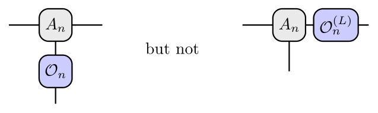
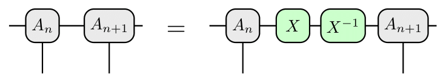
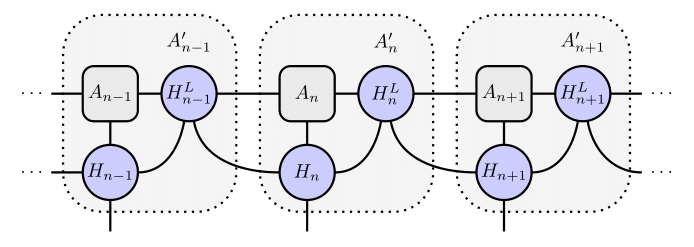

# Getting Started

## What are LEMPOs?

Link-enhanced matrix product operators (LEMPOs) are a generalization of standard matrix product operators (MPOs) that act on symmetric matrix product states (MPSs).

To see why symmetric MPSs admit such a generalization, first consider an unsymmetrized MPS tensor. The MPO contains operators that act on physical indices, but not operators that act on link indices:



And indeed, for an ordinary MPS, it would not make sense to act on a link leg. The reason is that the MPS is invariant under the regauging operation,



For an operator $\mathcal{O}^{(L)}$ to be invariant under the regauging, it would have to satisfy $X \mathcal{O}^{(L)} X^{-1} = \mathcal{O}^{(L)}$ for any invertible matrix $X$. This implies that $\mathcal{O}^{(L)}$ is proportional to the identity matrix.

However, for a symmetric MPS, each MPS tensor is an invariant tensor of some group. This means that the link spaces are decomposed into representations of that group. The MPS is still invariant under a regauging operation, but now the operator $X$ must respect the structure of the link space: $X$ can mix different copies of the same representation, but it cannot mix different representations. This implies that $\mathcal{O}^{(L)}$ must act as a constant times the identity matrix *on each representation block*, but the constants for different representations can be different. Thus, for a symmetric MPS, it becomes possible to have nontrivial link operators.

The most general LEMPO Hamiltonian acts on an MPS in the following way:



However, in `MPSKitLEMPO.jl`, we specialize to LEMPO Hamiltonians for which all link terms refer only to a single link at a time. This class of LEMPOs is useful for lattice gauge theory, as we will describe below.

## Why would I use LEMPOs?

In the [Kogut-Susskind](../assets/pdf/kogut1975.pdf) prescription for lattice gauge theory, we have matter degrees of freedom on sites and gauge degrees of freedom on links. Schematically, let us label the matter degrees of freedom by $\chi_n^a$, where $n$ is the site index and $a$ is an index for some representation of the gauge group $G$. The gauge bosons $U_n$ are valued in $G$, and so their conjugate variables $L_n^A$, with $A = 1,\ldots,\dim G$, transform in the adjoint representation of $G$. In 1+1 dimensions, the Kogut-Susskind Hamiltonian takes the form

```math
H = H_{\text{matter}}(\chi_n, U_n) + \# \sum_n L_n^A L_n^A.
```

The first term, the matter Hamiltonian, contains $U_n$ to build terms such as $\chi_n^a U_n^{ab} \chi_{n+1}^b$ that respect local gauge invariance. This means the matter Hamiltonian can be implemented as an MPO acting on a $G$-symmetric MPS. Then the second term, the gauge kinetic part of the Hamiltonian, is a sum of link operators that act on link representation spaces as the quadratic Casimir operator of $G$.

Many more details on this can be found in the [paper](https://arxiv.org/abs/2508.16363) introducing LEMPOs. The main takeaway is that a LEMPO is the most natural way to encode the Hamiltonian of a lattice gauge theory for use with matrix product states.

## MPOs and LEMPOs in `MPSKitLEMPO.jl`

In this package, LEMPOs are constructed as simple extensions of the `MPOHamiltonian` types in `MPSKit.jl`. Explicitly, we have
- `FiniteLEMPOHamiltonian`, based on `FiniteMPOHamiltonian` in `MPSKit.jl`
- `InfiniteLEMPOHamiltonian`, based on `InfiniteMPOHamiltonian` in `MPSKit.jl`
In each case, the LEMPO is an ordinary MPO plus a sum of on-link terms $\mathcal{O}_n^{(L)}$, which act on representation blocks $r_1$, $r_2$, etc. (of sizes $p_1$, $p_2$, etc.) as multiples of the identity:
```math
\mathcal{O}_n^{(L)} = \left(
\begin{array}{c|c|c}
F_n(r_1)\,\mathbb{1}_{p_1} & & \\
\hline
& F_n(r_2)\,\mathbb{1}_{p_2} & \\
\hline
& & \ddots
\end{array}
\right)
```
The LEMPO constructor takes an MPO and a list of the functions $F_n$ as arguments.

More details on these types, and the algorithms supported for them, can be found [here](../guide/finite_lempo.md) for the finite case and [here](../guide/infinite_lempo.md) for the infinite case.

## See also

`MPSKitLEMPO.jl` is heavily based upon [MPSKit.jl](https://github.com/maartenvd/MPSKit.jl), which in turn relies heavily upon [TensorKit.jl](https://github.com/Jutho/TensorKit.jl).

Many more details about LEMPOs, and examples of their use in gauge theory, can be found in [this paper](https://arxiv.org/abs/2508.16363).